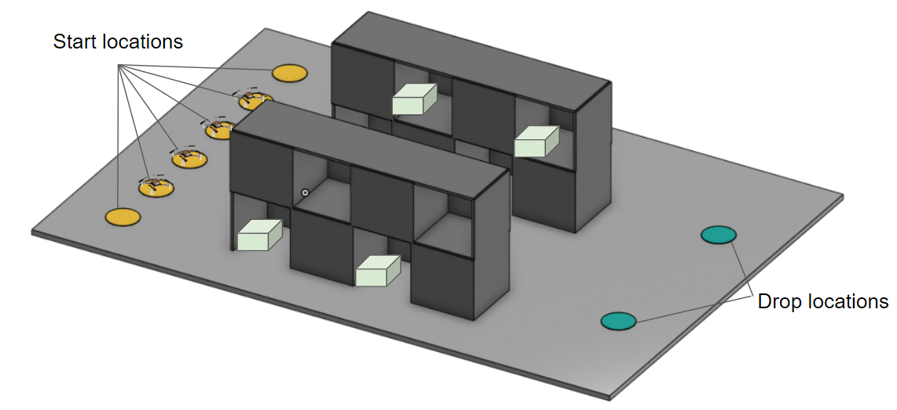
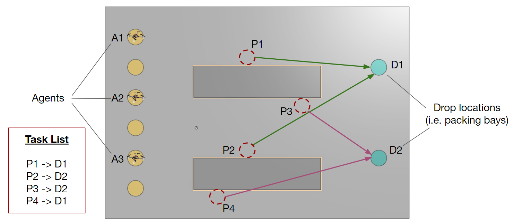
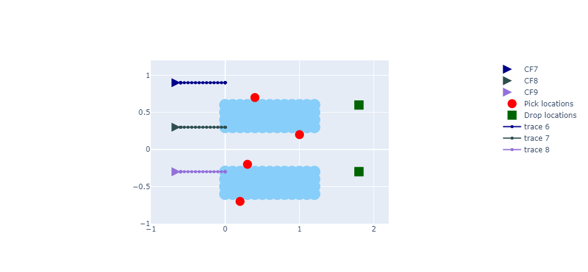
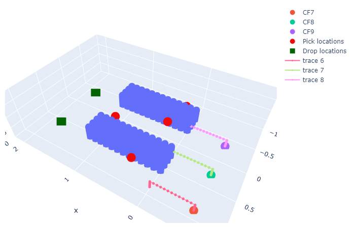

# Multi-Agent Coordination Project

## Project Goals

The learning goal for this project is to get you to achieve the following:

- Understand the system workflow for the multi-agent pickup and delivery (MAPD) problem
- Build confidence in controlling the Crazyflies using different control interfaces (e.g. position, velocity setpoints)
- Improve coding skills in Python
- Explore the multi-agent path finding (MAPF) problem in the context of the Hummingbird project

## Project Description

- Given a defined task list (including pick and drop locations for **N** deliveries), operate **M** Crazyflie agents to complete the defined task list as quickly as possible.
- Here, number of tasks (N) is 4, and number of Crazyflie agents (M) is 3. See images below for a graphical representation of the task list (specific information is provided in the `config.yaml` file)
- To make the project more tractable in the available time:
    - We will complete the task list in the flight area WITHOUT physical obstacles (i.e., bin racks)! However, you should plan your solution as if they were present.





---

## Setting up your PC

<aside>
📌 Of course, you should have already set up your PC by now (if so, just skip to **Step 3**), but just in case you need a refresher 🙂

</aside>

You can complete this assignment on any computer OS: Mac, Windows, Linux, etc. All you need is **Python 3.6+**.

### Step 0 (Optional)
Install Visual Studio Code (I strongly recommend using this, if you don’t already do. It’s the best IDE in my humble opinion)

- Follow this to install it: [Download Visual Studio Code - Mac, Linux, Windows](https://code.visualstudio.com/download)
    
    

### Step 1
Get Python 3 installed on your computer (if you do not already have it)

- To check if you have it, open your terminal (or CMD, PowerShell, etc.) and type:
    
    ```bash
    C:\Users\kmbanisi> python --version    # <--- type this
    Python 3.8.3                           # <--- you should see something like this
    ```
    
- If you don’t have Python installed, follow this tutorial to install it: [Python 3 Installation & Setup Guide - Real Python](https://realpython.com/installing-python/)
    
    

### Step 2
Create a virtual environment for this assignment [*This is technically optional, but I strongly recommend it*]

- Follow this tutorial (Windows): [Python Virtual Environments: A Primer - Real Python](https://realpython.com/python-virtual-environments-a-primer/)
- Follow this tutorial (Linux): [Create a Python virtual environment in the Linux terminal](https://www.pragmaticlinux.com/2021/12/create-a-python-virtual-environment-in-the-linux-terminal/)
    
    
    

### Step 3
Get the assignment repository from Github

- Clone this repository: [https://github.com/Olin-HAIR-Lab/multi-agent-coordination-project.git](https://github.com/Olin-HAIR-Lab/multi-agent-coordination-project.git)
    
- Follow this instruction to clone:
    
    ```bash
    # first: cd to your desired folder
    
    # then: git clone the project
    git clone https://github.com/Olin-HAIR-Lab/multi-agent-coordination-project.git
    cd multi-agent-coordination-project
    ```
    
    

### Step 4
Install all required Python packages

```bash
# first: make sure you have activated the virtual environment (if you used one). See step 2 tutorial

# cd to the project folder
cd multi-agent-coordination-project

# install all required packages from requirements.txt
python -m pip install -r requirements.txt
```


### Step 5
There are TWO ways to interact with this project:

1. You can work out of the Jupyter Notebook directly from VSCode, in that case, you’ll use the `main.ipynb` file **[This is what I recommend]**
2. You can work out of a normal python script. In this case, run the following:

```bash
python main.py
```

## What to do and what to submit

- **Task 1**: Review and understand Task and Agent definitions in STEP 1 in the `main.ipynb` file
    - **N.B.:** There’s nothing to implement here. Just understand what we’re doing.
    
- **Task 2:** Review and understand the **multi-agent task assignment** implementation in STEP 2 in the `main.ipynb` file
    - **N.B.:** There’s nothing to implement here. Just understand what we’re doing.
    
- **Task 3:** Run the existing code:
    - **Task 3.1**: Run it in simulation and obtain plots such as below:
        - Solution Plots:
            
            
            
            
            
    - **Task 3.2**: Run it on the Crazyflies (make sure to set the right parameters in the `config.yaml` file.
        - Obtain plots as shown above and also record a video
        
- **Task 4**: Implement a (simple) **multi-agent path finding algorithm** (STEP 3 in the `main.ipynb` file) that computes a conflict-free paths/trajectory for each agent.
    
    
- **Task 5**: Integrate your (existing) **trajectory-following algorithm** from the Module 2 project (STEP 4 in the `main.ipynb` file)

